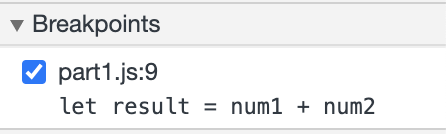

# Part 3

## DevTools - Debugging

1.
The bug was that num1 and num2 were strings trying to added together, which because they were not integers, resulted in a concatenation instead of a sum (num1 + num2 = num1num2). This is a bug because the intended function is sum the integers stored in the strings num1 and num2, not concatenate them.

2.
To fix it, all you need to do convert num1 and num2 to ints (using the method parseInt) in the calculateSum function before you add them and get the result. This way, their sum is stored in result, not the concatenation.

## DevTools - Network Tab

3.
citylots.json

4.
part2.js

5.
11.7 MB

6.
3.84 seconds

7.
Mozilla/5.0 (Macintosh; Intel Mac OS X 10_15_7) AppleWebKit/537.36 (KHTML, like Gecko) Chrome/90.0.4430.85 Safari/537.36

8.
Apache

9.
Tuesday, Jan 26, 2021 , 22:14:13 GMT

10.
application/json

11.
fetchData()